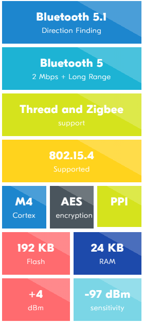
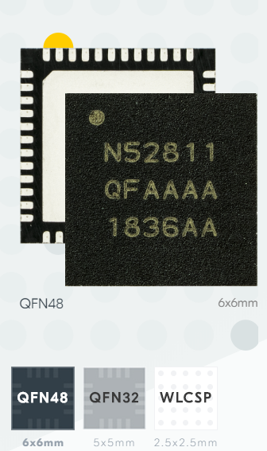

# [nRF52811](https://github.com/sochub/nRF52811) 
 
####  qitas@qitas.cn
#### 归属：[cortex M4](https://github.com/sochub/CM4) 
#### 父级：[nordic](https://github.com/sochub/NRF52) 

### [简介](https://github.com/sochub/nRF52811/wiki)

Bluetooth 5.1 Direction Finding SoC with comprehensive protocol support. the 4th addition to the nRF52 Series platform.

* support for Bluetooth 5.1, Bluetooth 5.1 Directing Finding, all Bluetooth 5 features, 802.15.4, Thread, Zigbee, ANT and 2.4 GHz proprietary.

* Cortex™-M4 CPU with floating point unit running at 64 MHz. 

 
 

* 6x6 mm QFN48 with 32 GPIOs
* 5x5 mm QFN32 with 17 GPIOs
* 2.48x2.46 mm WLCSP32 with 15 GPIOs
* Bluetooth LE - Long Range: 	-104 dBm
* Bluetooth LE - 1 Mbps:		-97 dBm
* 802.15.4 (Thread/Zigbee):	-101 dBm

##  [SoC开发平台](http://www.qitas.cn)  

