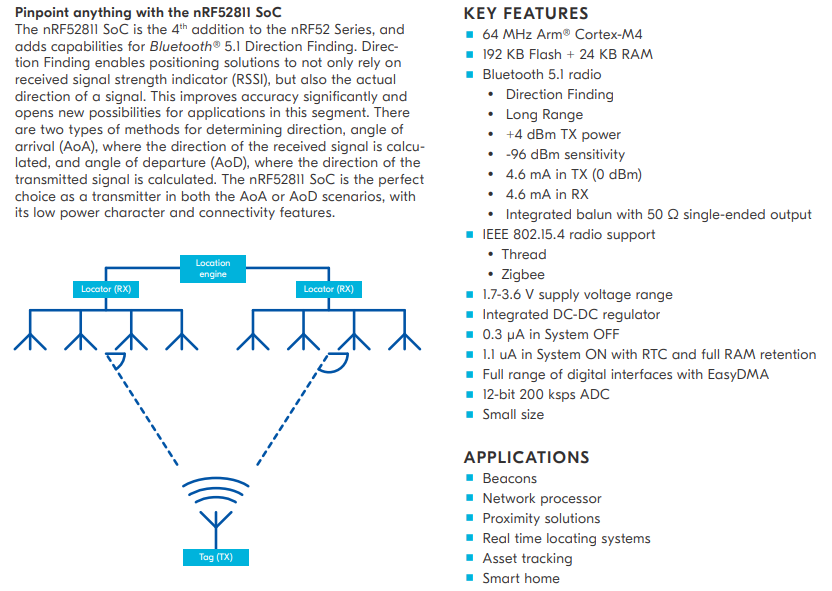

# [nRF52811](https://github.com/SoCXin/nRF52811) 

 

#### [Vendor](https://github.com/SoCXin/Vendor) ：[Nordic](https://github.com/SoCXin/Nordic) 
#### [Core](https://github.com/SoCXin/Cortex) ：[Cortex M4](https://github.com/SoCXin/CM4) 
#### [Level](https://github.com/SoCXin/Level) ：64MHz 

### [nRF52811简介](https://github.com/SoCXin/nRF52811/wiki)

[nRF52811](https://www.nordicsemi.com/Products/Low-power-short-range-wireless/nRF52811) Bluetooth 5.1 Direction Finding SoC with comprehensive protocol support. the 4th addition to the nRF52 Series platform.

* support for Bluetooth 5.1, Bluetooth 5.1 Directing Finding, all Bluetooth 5 features, 802.15.4, Thread, Zigbee, ANT and 2.4 GHz proprietary.

 

* 6x6 mm QFN48 with 32 GPIOs
* 5x5 mm QFN32 with 17 GPIOs
* 2.48x2.46 mm WLCSP32 with 15 GPIOs
* Bluetooth LE - Long Range:  -104 dBm
* Bluetooth LE - 1 Mbps:	 -97 dBm
* 802.15.4 (Thread/Zigbee):	-101 dBm

### [资源收录](https://github.com/SoCXin)

* [文档](docs/)
* [资源](src/)

### [关联资源](https://github.com/SoCXin)

* [nRF-IEEE-802.15.4-radio-driver](https://github.com/NordicSemiconductor/nRF-IEEE-802.15.4-radio-driver)

### [选型建议](https://github.com/SoCXin)

[nRF52811](https://github.com/SoCXin/nRF52811) 支持BLE 5.2

###  [SoC芯平台](http://SoC.Xin) 
